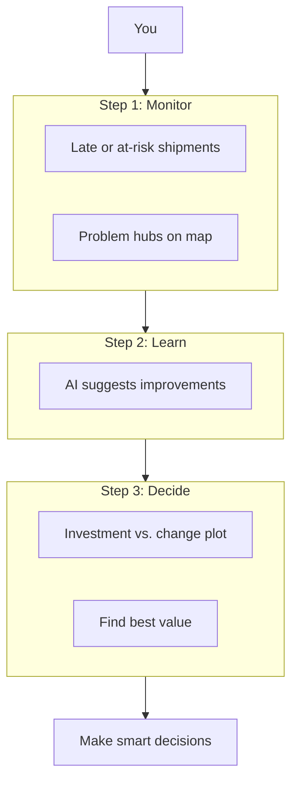

# SupplyMind AI

## Description

📦 **SupplyMind AI** is a smart dashboard that watches your packages as they travel and tells you which ones might arrive late. It helps supply chain managers track shipments in real time, predict delivery delays, and find ways to improve their operations—all in one place.

**Who is it for?** Supply chain managers who want to see delivery status at a glance and take action before problems grow.

🚀 **[Try the live app](https://019cc876-2199-a739-4a67-dc4bb96d2042.share.connect.posit.cloud/)** — Deployed on Posit Connect Cloud.

---

## 📚 Documentation

**[Documentation Index](docs/DOCUMENTATION_INDEX.md)** — One place to find everything.

| Document | What you'll find |
|----------|------------------|
| 📖 [Getting Started](docs/GETTING_STARTED.md) | Your first 10 minutes: setup, install, and run |
| 📝 [Glossary](docs/GLOSSARY.md) | Terms, concepts, and plain-language explanations |
| 🔧 [Troubleshooting](docs/TROUBLESHOOTING.md) | When something goes wrong |
| 🏗️ [Architecture Overview](docs/ARCHITECTURE_OVERVIEW.md) | How it all fits together |
| 🎨 [Icons Reference](docs/icons.md) | Unicode icons for READMEs and docs |

The **User Guide** (card-by-card tour) is in this README below.

---

## 📁 Project Structure

| Folder | Description |
|--------|-------------|
| `docs/` | Documentation (guides, context, predictions, optimization) |
| `SupplyMindAI/` | Shiny app (`app.py`), analysis pipeline, logo assets |
| `db/` | Supabase client and database utilities |

See [docs/context.md](docs/context.md) for full project context, requirements, and database schema.

---

## ⚡ Quick Start

1. Copy `.env.example` to `.env` and set:
   - `POSTGRES_CONNECTION_STRING` — or use **`DIRECT_URL`** / **`DATABASE_URL`** from Supabase **Connect → ORM** (see [`.env.example`](.env.example))
   - `OPENAI_API_KEY` — your OpenAI API key

2. Install dependencies:
   ```bash
   pip install -r SupplyMindAI/requirements.txt
   ```

3. Run the Shiny app (opens in browser automatically):
   ```bash
   shiny run SupplyMindAI/app.py --launch-browser
   ```
   Or use the run script: `.\run.ps1`

The app analyzes in-transit shipments on load and via the "Re-run Analysis" button, flagging them as On Time, Delayed, or Critical. The UI works on computers, tablets, and phones. 📱💻

---

## User Guide

This guide introduces the SupplyMind AI dashboard and explains how to use it. For each card, you'll learn what you see, what it means, how to use it, and—for those who want the details—what data it uses and how it works.

**Try the app while you read:** [Open the live app](https://019cc876-2199-a739-4a67-dc4bb96d2042.share.connect.posit.cloud/) in another tab and follow along.

## Table of Contents

- [Introduction](#introduction)
- [Card 1: Current Shipment Delivery Insight](#card-1-current-shipment-delivery-insight)
- [Card 2: Prediction Map](#card-2-prediction-map)
- [Card 3: Supply Chain Optimization](#card-3-supply-chain-optimization)
- [Card 4: Parameter Simulation + Simulation Result](#card-4-parameter-simulation--simulation-result)
- [Quick Reference](#quick-reference)
- [Support](#support)

---

## Introduction

### What is SupplyMind AI?

SupplyMind AI is an end-to-end dashboard for supply chain managers. It helps you monitor in-progress shipments, get AI-powered recommendations from historical data, and run simulations to decide how much to change—all in one place.

### What does it do?

1. **Card 1 — Analyze and manage in-progress shipments:** See which shipments are on time, delayed, or critical. Use the Prediction Map to spot problem hubs. Escalate urgent shipments and take action.
2. **Card 2 and 3 — Use historical data for insights:** Pick a date range and analyze past deliveries. The AI identifies what went wrong and suggests changes (e.g., increase hub capacity, reduce dwell time).
3. **Card 4 — Run simulation to understand how much to change:** Select the recommended changes and run a simulation. See how investment ($) affects on-time deliveries and find the best "sweet spot" before committing real resources.

### Simple workflow



| Step | What you do |
|------|-------------|
| **1. Monitor** | Analyze in-progress shipments, see which are at risk, escalate critical ones, view hub map. |
| **2. Learn** | Get AI recommendations from historical delivered data. See what changes could improve your supply chain. |
| **3. Decide** | Run simulations on suggested changes. Find the right level of investment before implementing. |

### How to use this guide

Each card section covers what you see, what it means, and how to use it. For readers who want more detail, "Deep dive" subsections explain the underlying data, logic, and algorithms. Use the table of contents above to jump to any section.

---

## Card 1: Current Shipment Delivery Insight

### What you see

A section titled "Current Shipment Delivery Insight" with a **Re-run Analysis** button, several small cards showing numbers (Total In Transit, On Time, Delayed, Critical), and a donut chart in the center.

### What it means

- **Total In Transit:** How many shipments are currently on the road (not yet delivered).
- **On Time:** Shipments expected to arrive by their deadline (green).
- **Delayed:** Shipments likely to arrive late (amber/orange).
- **Critical:** High-priority shipments that are likely late (red). These need your attention.
- **Donut chart:** The same breakdown in a pie view. The center shows **AI confidence**—how sure the AI is about its predictions (0–100%). Higher is better.

### How to use it

1. Click **Re-run Analysis** when you want fresh predictions (e.g., after new data is added).
2. Glance at the KPIs and donut to see the big picture.

**Example:** If you see "5 Total In Transit, 2 On Time, 2 Delayed, 1 Critical," you know one shipment needs immediate attention.

### Deep dive: What it does

The Current Shipment Delivery Insight card shows AI predictions for all in-transit shipments. It summarizes them as KPI counts (Total, On Time, Delayed, Critical) and a donut chart, and writes results into the `insights` table.

### Deep dive: Data used for analysis

The analysis pipeline reads from four tables. Only shipments with `status = 'In Transit'` are used.

**Dataset structure (headers):**

| Table | Column Headers |
|-------|----------------|
| `shipments` | shipment_id \| material_type \| priority_level \| total_stops \| current_stop_index \| final_deadline \| status |
| `stops` | shipment_id \| stop_number \| hub_name \| planned_arrival \| actual_arrival \| planned_departure \| actual_departure |
| `hubs` | hub_name \| lat \| lon \| current_load \| max_capacity \| status |
| `risks` | hub_name \| category \| severity \| est_delay_hrs |

- **shipments:** Only rows with `status = 'In Transit'`. Provides shipment metadata and the deadline.
- **stops:** For each shipment, all stops (past and future). Used to compare actual vs planned times and to find which hubs the shipment will visit next.
- **hubs:** Only for *future* stops (stop_number > current_stop_index). Provides `current_load`, `max_capacity`, and `status` (Open, Congested, Closed).
- **risks:** For those same future hub names. Provides `category` (Weather, Traffic, Labor), `severity` (1–10), and `est_delay_hrs` (estimated delay in hours).

### Deep dive: Parameters the AI uses to predict the flag

The AI decides On Time / Delayed / Critical based on:

1. **Past stop performance:** For completed stops, is `actual_arrival` after `planned_arrival`? If yes, that suggests delay.
2. **Future hub status:** Are any future hubs Congested or Closed? If yes, more likely delayed.
3. **Future risks:** Any `severity >= 7` or high `est_delay_hrs`? If yes, more likely delayed.
4. **priority_level:** Only shipments with `priority_level >= 8` can be Critical. If `priority_level < 8`, the AI must use Delayed, never Critical.

### Deep dive: Flags and their meanings

| Flag | Meaning | Criteria |
|------|---------|----------|
| **On Time** | Expected to meet the deadline | All past stops on time, future hubs Open, no high-severity risks (severity ≤ 4). |
| **Delayed** | Likely to arrive late | Past stops late, OR future hubs Congested/Closed, OR high-severity risks (severity ≥ 7). |
| **Critical** | High-priority and delayed | Same as Delayed, **and** `priority_level >= 8`. |

### Deep dive: AI confidence

The AI returns a confidence score from 1 to 10. If it is missing or invalid, a **heuristic** is used:

- **High (8):** Data clearly supports the flag—e.g., all past stops on time and no risks for On Time, or clear late signals for Delayed/Critical.
- **Low (4):** Data is mixed or conflicting—e.g., On Time flag but past stops were late, or Delayed flag but all hubs Open and low risk.

The donut chart center shows the average confidence scaled to 0–100%.

### Deep dive: Mathematical model (confidence heuristic)

When the AI does not return a valid confidence, the heuristic uses:

| Variable | Definition |
|----------|------------|
| `past_on_time` | True if, for all completed stops, `actual_arrival ≤ planned_arrival` |
| `all_open` | True if all future hubs have `status = "open"` |
| `max_sev` | Maximum `severity` among future risks (0 if none) |

**Scoring rules:**

- **On Time:** If `past_on_time ∧ all_open ∧ max_sev ≤ 4` → score = 8; else if `¬past_on_time ∨ max_sev ≥ 7` → score = 4.
- **Delayed / Critical:** If `¬past_on_time ∨ max_sev ≥ 7` → score = 8; else if `all_open ∧ max_sev ≤ 3` → score = 4.

**Output:** `confidence = max(1, min(10, score))`

### Deep dive: Output

Results are written to the `insights` table:

| Table | Column Headers |
|-------|----------------|
| `insights` | insight_id \| shipment_id \| flag_status \| predicted_arrival \| reasoning \| confidence |

The dashboard reads from `insights` to show the KPIs and donut chart.

### Card 1.2: Needs Attention (Right Panel)

**What you see:** A list of shipments that are marked **Critical**. Each row shows a shipment ID (bold, red, clickable), a short reason (e.g., "Delays at Chicago-Main due to traffic and bad weather."), and an **Escalate** button.

**What it means:** These are the shipments that most need action—high priority and likely late.

**How to use it:**
1. **Click a shipment ID** to open a pop-up with full details.
2. **Click Escalate** to add that shipment to your personal list (saved in the drawer).
3. Use **View Escalated** to open the drawer and see everything you've escalated.

**Example:** Click "SHIP-007" → modal opens with full reasoning and predicted arrival → click Escalate → shipment appears in the Escalated drawer.

**Deep dive — What it does:** Shows only shipments with `flag_status = 'Critical'` from the `insights` table.

**Deep dive — Data:** Same `insights` table as Card 1. Each row includes `shipment_id`, `reasoning`, and `flag_status`. The UI shows a condensed version of the reasoning.

### Insight Detail Modal (Pop-up)

**What you see:** A pop-up window that opens when you click a shipment ID. It shows the category (On Time / Delayed / Critical), the AI's full reasoning, the predicted arrival time, and the target deadline.

**What it means:** The full story for that shipment—why the AI flagged it and when it expects it to arrive.

**How to use it:** Read the details, then click **Close** or click outside the pop-up to dismiss it.

### Escalated Shipments Drawer

**What you see:** A panel that slides in from the right. It shows a list of shipments you've clicked **Escalate** on.

**What it means:** Your personal to-do list of shipments that need follow-up.

**How to use it:**
1. Click **View Escalated** (or "View Escalated (N)") in the Needs Attention section to open it.
2. Use **Clear all** at the top to remove all items from the list.
3. Click the X or outside the drawer to close it.

---

## Card 2: Prediction Map

**What you see:** A map with summary on the left and map on the right. The summary explains hub colors and "What you can do" in numbered steps. Dots on the map represent hubs—black for all locations, red and orange for problem areas. Hover to see hub name and shipment counts.

**What it means:**
- 🔴 **Red hubs:** High-priority shipments predicted to be delayed.
- 🟠 **Orange hubs:** Shipments predicted to arrive late.
- ⚫ **Black hubs:** All hub locations (base layer).

Dot size scales with the number of Critical/Delayed shipments at that hub.

**How to use it:** Focus on red hubs first, then orange. Use the map to decide where to add capacity or adjust routing. Escalate critical shipments from the Needs Attention panel above. Hover for exact counts; drag to pan, scroll to zoom.

**Example:** Hover over a red dot in Chicago → tooltip shows the hub name and count of at-risk shipments.

**Note:** If you see "Run analysis to see hub map," run the analysis first (Re-run Analysis in Current Shipment Delivery Insight).

**Deep dive — What it does:** Plots hubs on a US map. Each hub gets a color based on the worst flag among shipments that visit it (Critical > Delayed > On Time). Dot size scales with the number of Critical/Delayed shipments at that hub.

**Deep dive — Data:** Hubs from `hubs` (for coordinates) and flags from `insights` (per shipment). The app joins stops to shipments, then maps each hub to its worst flag.

| Output | Headers |
|--------|---------|
| `status_hubs` | hub_name \| lat \| lon \| status \| in_delayed_count |

- **status:** "red", "orange", or "green" (worst flag at that hub).
- **in_delayed_count:** Number of shipments with Delayed or Critical that visit that hub.

---

## Card 3: Supply Chain Optimization

### What you see

A section with a date range dropdown (Yesterday, Past week, Past month, Past year, Custom) and a **Get Supply Chain Insights** button. After you run it, you see a summary and a list of suggested changes.

### What it means

The app looks at past *delivered* shipments in the chosen date range and asks the AI what could be improved—for example, "Hub Chicago: Increase capacity" or "Reduce dwell time at Dallas."

### How to use it

1. Choose a date range.
2. If you pick **Custom**, select a start and end date (max 1 year).
3. Click **Get Supply Chain Insights**.
4. Wait for the summary and suggested changes to appear.
5. Read the suggestions—they will feed into Parameter Simulation below.

**Example:** Select "Past year" → click Get Supply Chain Insights → see "Analyzed 45 on-time and 12 delayed deliveries" and suggestions like "Hub Chicago: Increase capacity."

### Deep dive: What it does

Analyzes *delivered* (historical) shipments in a date range. Splits them into on-time vs delayed, computes metrics, and asks the AI for improvement recommendations. Recommendations are constrained to five levers so they can be simulated.

### Deep dive: Data used

- **Date range:** User selects Yesterday, Past week, Past month, Past year, or Custom (max 1 year).
- **shipments:** Only rows with `status = 'Delivered'` and `delivery_ts` (from last stop) in the range. Capped at 200 shipments.
- **stops, hubs, risks:** Enriched per stop with hub occupancy and risk info.

**Dataset structure (headers):**

| Table/Payload | Headers |
|---------------|---------|
| Delivered shipments | shipment_id \| material_type \| priority_level \| total_stops \| final_deadline \| delivery_ts |
| Enriched stop | stop_number \| hub_name \| planned_arrival \| actual_arrival \| planned_departure \| actual_departure \| current_load \| max_capacity \| status \| risks (array) |
| Metrics | avg_delay_hours \| top_delayed_hubs \| common_risk_categories |
| control_parameters | Array of strings (e.g., "Hub Chicago: Increase capacity") |

### Deep dive: Flow

1. Fetch delivered shipments in the date range.
2. For each shipment, fetch stops with hub and risk data.
3. Split on-time (`delivery_ts <= final_deadline`) vs delayed (`delivery_ts > final_deadline`).
4. Compute metrics: average delay, top delayed hubs, common risk categories.
5. Call OpenAI with a constrained prompt so it recommends only actions that map to the five levers.
6. Display summary, `control_parameters`, and `top_parameters`.

### Deep dive: Parameters → Levers

The AI can only suggest actions that map to these five simulation levers:

| Lever | AI Recommendation Phrasing | What You Control |
|-------|----------------------------|------------------|
| hub_capacity | "Hub X: Increase capacity" | Capacity multiplier k (1.0–2.0): C_sim = k × nominal max_capacity; k=1.0 no increase, k=1.2 = +20% |
| dispatch_time_at_hub | "Hub X: Reduce dwell time" | Dwell reduction (0–100%) |
| transit_mode | "Use faster transit" | Fraction of modeled delay removed (0–1.0; 1.0 can fully recover in simulation) |
| earlier_dispatch | "Dispatch earlier" | Hours earlier (0–720, up to ~30 days in the model) |
| risk_based_buffer | "Add risk-based ETA buffer" | Buffer factor ρ (0–8) applied to Σ est_delay_hrs |

The Parameter Simulation chips are parsed from these recommendations. When you select parameters and click **Run simulation**, those selections are sent to the simulation engine.

---

## Card 4: Parameter Simulation + Simulation Result

### Parameter Simulation

**What you see:** After you run Supply Chain Insights, a second column appears: **Parameters to simulate** with a **?** button (top-right) that opens a collapsible "What each parameter does" panel. You see badge chips (e.g., "Hub Chicago: Increase capacity") and a drop zone for "Selected parameters." Each selected chip has a (×) to remove it; **Clear all** appears below. A **Run simulation** button is at the bottom.

**What it means:** You can pick which suggested changes to simulate—like testing "what if we increased capacity at Chicago?" The simulation shows how many more shipments would be on time and at what cost.

**How to use it:**
1. Click a chip to add it to "Selected parameters," or drag it into the drop zone.
2. Click the chip again or the (×) next to it to remove it; use **Clear all** to remove all selected parameters.
3. Select one to five parameters.
4. Click **Run simulation**.
5. The Simulation Result card appears below.

**Example:** Click "Hub Chicago: Increase capacity" → it appears in Selected parameters → click Run simulation → chart and recommendations appear.

### Simulation Result

**What you see:** A card with a chart and a recommendations panel. Above the chart, a legend explains: ★ **Best investment point (sweet spot):** where you get the most on-time improvement per dollar. The chart has Investment ($) on the horizontal axis and **On-time shipments** on the vertical axis. Each selected parameter gets a colored line. Gold stars mark the sweet spot for each. The recommendations panel shows AI-generated advice with investment, recovered shipments, and ROI.

**What it means:**
- **Chart:** Shows how many shipments become on time as you invest more in each change.
- **★ Best investment point (sweet spot):** The recommended point—good results without overspending.
- **Recommendations:** The AI picks the best options and explains why.

**How to use it:** Use the recommendations to decide which changes to implement. The caveat at the bottom reminds you that results are based on simulation, not live data.

### Deep dive: What it does

Runs simulations for the parameters you selected. For each lever value, it recomputes delays and reclassifies shipments as on-time if the simulated delay is zero or negative. It finds a "sweet spot" and generates AI recommendations based on the curves.

### Deep dive: Data used

The same enriched payloads from Card 3: `on_time_raw` and `delayed_raw`. Each delayed payload includes `delay_hours` (how late the shipment was).

**Dataset structure (headers):**

| Payload | Headers |
|---------|---------|
| `delayed_raw` (per item) | shipment_id \| delay_hours \| stops (with current_load, max_capacity, risks) |
| Curve output | value \| investment_usd \| on_time_count \| delayed_count \| avg_delay |
| chart_points_3 | (investment_usd, on_time_count, label) for Min, Sweet spot, Max |
| Recommendation output | recommendation_1 \| recommendation_2 \| recommendation_3 \| alternative_params_message |

### Deep dive: Algorithm (per lever)

**Hub capacity (lever 1):**  
Delay is split into congestion and risk. Congestion delay at a hub = `max(0, (current_load - capacity) / capacity) × α` (α = 3). Simulate with multiplier k on recorded max_capacity: `capacity_new = k × capacity_orig` (k=1.0 = no increase vs nominal; k=1.2 = 20% more effective capacity). Recompute congestion; risk stays the same.

**Time-shift levers (2–5):**  
`D_sim = max(0, D_obs - reduction_hrs)`, where `reduction_hrs` comes from the lever value. Dispatch uses `value × max(total dwell, min(D_obs, 72h))` so the curve can move when recorded dwell is small but the shipment is still late.

**Reclassification:**  
If `D_sim ≤ 0`, the shipment is "recovered" (counted as on-time). On-time shipments stay on-time.

**Grid search:**  
11 steps from min to max value. For each step, run `simulate_delays` and get `on_time_count`, `recovered_count`, `avg_delay`.

### Deep dive: Mathematical models

**1. Congestion delay (hub capacity)**

`D_cong = max(0, (L - C) / C) × α`

- *L* = current load at hub  
- *C* = max capacity  
- *α* = 3 (hours per 100% overflow)

**2. Delay decomposition (hub capacity lever)**

`D_obs = D_base + Σ D_cong + Σ D_risk`  
`D_sim = D_base + Σ D_cong_sim + Σ D_risk`

- Simulated capacity: *C_use = k × C_orig* (*k* = lever value; k=1.0 baseline, k=1.2 = +20% vs nominal; only at target hub)
- Risk contribution unchanged

**3. Time-shift (levers 2–5)**

`D_sim = max(0, D_obs - reduction_hrs)`

- **Dwell:** reduction = value × total_dwell_hours  
- **Transit:** reduction = value × D_obs (value ∈ [0, 1.0])  
- **Earlier dispatch:** reduction = value (hours)  
- **Risk buffer:** reduction = value × Σ est_delay_hrs

**4. Investment (cost model)**

`Investment (USD) = max(0, lever_value - value_min) × COST_PER_UNIT`

| Lever | COST_PER_UNIT (USD) |
|-------|---------------------|
| hub_capacity | 1,000,000 |
| dispatch_time_at_hub | 500,000 |
| transit_mode | 1,600,000 |
| earlier_dispatch | 2,000 |
| risk_based_buffer | 200,000 |

**5. Sweet spot (ROI objective)**

`ROI = recovered / investment`

The sweet spot is the lever value that maximizes ROI (smallest investment that recovers shipments).

### Deep dive: Sweet spot

- **ROI (default):** Maximizes `recovered / investment`. Favors the smallest investment that still recovers shipments.
- **on_time:** Maximizes total on-time count.
- **avg_delay:** Minimizes average delay among still-delayed shipments.

The gold star on the chart marks the sweet spot for each curve.

### Deep dive: Recommendation generation

After simulation, the AI receives the curve data (investment, on-time counts, recovered counts) and returns:

- **recommendation_1:** Primary action—best parameter, investment, expected improvement.
- **recommendation_2, recommendation_3:** Alternates or null.
- **alternative_params_message:** Suggests replacing low-impact parameters with others from the simulatable list.

Recommendations are based on investment ($), recovered count, and ROI.

---

## Quick Reference

| Action | Where |
|--------|-------|
| Refresh predictions | Re-run Analysis (Current Shipment Delivery Insight) |
| See full details for a shipment | Click shipment ID (Needs Attention) |
| Add shipment to your list | Escalate (Needs Attention) |
| Open your escalated list | View Escalated |
| Get improvement suggestions | Supply Chain Optimization → Get Supply Chain Insights |
| Simulate changes | Parameter Simulation → select params → Run simulation |

---

## Support

- 🔧 **Something not working?** See [Troubleshooting](docs/TROUBLESHOOTING.md).
- 📝 **Need a term explained?** See the [Glossary](docs/GLOSSARY.md).
- ⚡ **Want to run the app locally?** See [Getting Started](docs/GETTING_STARTED.md).
