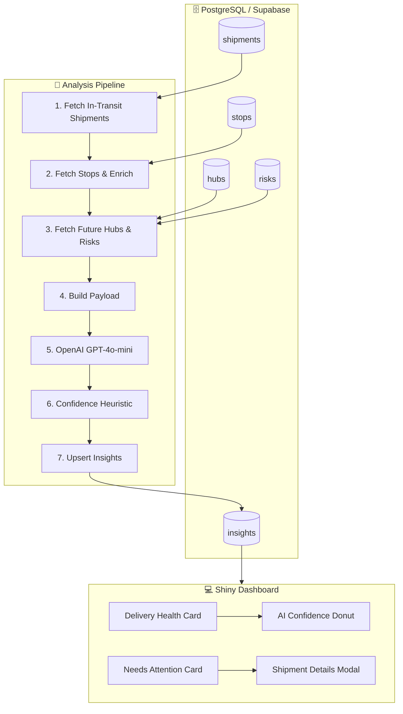

# SupplyMind AI — Predictions, Confidence & Architecture

📊 **Data & Analytics** · 🤖 **AI / automation** · ⚙️ **Process** · 🧠 **Insights** · 🔍 **Analysis**

How we built the delay predictions, the AI confidence heuristic, and the system architecture.

---

## 📋 Table of Contents

- [Architecture Overview](#-architecture-overview)
- [Predictions We Created](#-predictions-we-created)
- [AI Confidence Heuristic](#-ai-confidence-heuristic)
- [How We Built It](#-how-we-built-it)

---

## 🏗️ Architecture Overview

---

## 📈 Predictions We Created

### 🏷️ Flag Classification

Each in-transit shipment is classified into one of three flags:

| Flag | Meaning | Criteria |
|------|---------|----------|
| 🟢 **On Time** | No delays expected | Past stops on time; future hubs Open; no high-severity risks (≤4) |
| 🟡 **Delayed** | Delays likely | Past stops late, OR future hubs Congested/Closed, OR high-severity risks (≥7) |
| 🔴 **Critical** | High-priority + delayed | Same as Delayed, **and** `priority_level >= 8` |

### ⏰ Predicted Arrival

- **On Time:** `null` (no predicted delay)
- **Delayed / Critical:** ISO8601 timestamp — must be **after** the `final_deadline` (delays push arrival later)
- Uses `est_delay_hrs` from the `risks` table and past stop performance to estimate

### 💬 Reasoning Format

We enforce a consistent, readable format for managers:

- **1–2 sentences** with hub names and risk types (congestion, traffic, bad weather, labor)
- **Example:** `Delays at Chicago-Main and Detroit-Midwest due to traffic, labor, and bad weather.`
- **Optional second sentence:** `Additional delays at Dallas-Central from labor and bad weather.`
- **Commas for 3+ items:** `traffic, labor, and bad weather`
- **No** severity numbers, priority levels, or boilerplate like "predicted arrival is after the final deadline"

---

## 🧮 AI Confidence Heuristic

The model returns a confidence score (1–10). When that is missing or invalid, we use a **data-based heuristic**:

🔢 **Neutral baseline:** 5

### 🟢 High Confidence (8)

- **On Time:** Past stops on time + all future hubs Open + max risk severity ≤ 4
- **Delayed/Critical:** Past stops late OR max risk severity ≥ 7 (clear delay signals)

### 🟡 Low Confidence (4)

- **On Time:** Past stops late OR max risk severity ≥ 7 (conflicting with "On Time" flag)
- **Delayed/Critical:** All hubs Open and max severity ≤ 3 (weaker delay signals)

### 📊 Dashboard Display

- Donut chart center: **average confidence %** across all insights (1–10 scaled to 0–100%)
- Hover: shows shipment count per segment, not redundant percentages

---

## 🔧 How We Built It

### 1. 🧩 Pipeline (`analysis/pipeline.py`)

1. **Fetch** in-transit shipments from `shipments`
2. **Fetch** stops (arrival/departure) for each shipment
3. **Enrich** with future hubs (occupancy) and risks (severity, category, `est_delay_hrs`)
4. **Build payload** (shipment, stops, future_hubs, future_risks) for OpenAI
5. **Call OpenAI** (GPT-4o-mini) with a structured prompt; parse JSON response
6. **Apply confidence heuristic** if model confidence is invalid
7. **Upsert** results into `insights` (flag, predicted_arrival, reasoning)

### 2. 💻 Dashboard (`app.py`)

- **Delivery Health:** 📊 KPI cards (Total, On Time, Delayed, Critical), donut chart, Re-run Analysis
- **Needs Attention:** Critical shipments with condensed summaries; click shipment ID for full insight modal
- **Escalation:** Escalate button adds shipment to sidebar; View Escalated opens drawer

### 3. ✨ Summary Formatting

- **List:** `_condense_reason()` → `Delays at [hubs] due to [risks].`
- **Modal:** `_modal_reason()` — full reasoning (up to 2 sentences), stripped of severity/priority
- **Serialization:** `_join_list()` — commas for 3+ items: `a, b, and c`

---

  <b>🏠 <a href="README.md">Back to SupplyMindAI</a></b>

