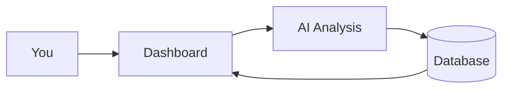

# Architecture Overview — How It All Fits Together

A high-level view of how SupplyMind AI works. No deep technical knowledge required.

---

## The Big Picture

You use the dashboard. The dashboard reads and writes data in the database and calls the AI for predictions and recommendations. Results show up in the dashboard.

---

## What Happens When You Use the App

1. **You open the dashboard** — The app loads. If there are existing insights in the database, they appear right away.

2. **You click Re-run Analysis** — The app:
   - Reads in-transit shipments from the database
   - Fetches their stops, future hubs, and risks
   - Sends each shipment to the AI for a prediction
   - Writes the results (On Time, Delayed, Critical) into the `insights` table
   - Updates the KPIs, donut chart, and map

3. **You click Get Supply Chain Insights** — The app:
   - Reads delivered shipments in your date range
   - Splits them into on-time vs delayed
   - Computes metrics (avg delay, top hubs, risk categories)
   - Asks the AI for improvement recommendations (constrained to five levers)
   - Shows the summary and suggested changes

4. **You run a simulation** — The app:
   - Takes the delivered payloads and your selected parameters
   - For each lever value, recomputes delays and reclassifies shipments
   - Finds the sweet spot for each parameter
   - Asks the AI to generate recommendations from the curves
   - Shows the chart and recommendations

---

## Main Pieces

| Piece | Role |
|-------|------|
| **Dashboard (Shiny)** | The web interface you see. Built with Shiny for Python and Bootstrap. |
| **Analysis pipeline** | Fetches in-transit data, calls OpenAI, writes insights. |
| **Optimization pipeline** | Fetches delivered data, splits on-time/delayed, calls OpenAI for recommendations. |
| **Simulation engine** | Runs the delay model for different lever values and finds sweet spots. |
| **Database (Supabase)** | Stores shipments, stops, hubs, risks, and insights. |

---

## Deeper Technical Details

For more technical documentation, see:

- [context.md](context.md) — Project overview, stakeholders, database schema
- [predictions.md](predictions.md) — How predictions work, AI confidence, architecture
- [optimization-simulation.md](optimization-simulation.md) — The five levers, simulation formulas, workflows
