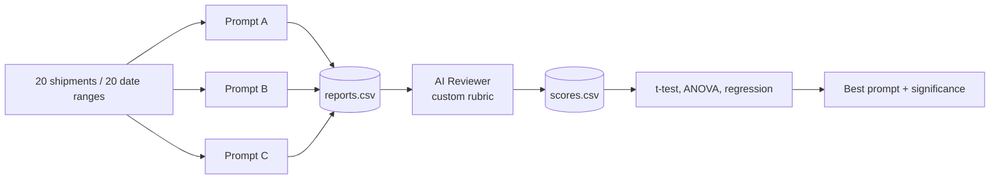

# AI Report Validation System for SupplyMind AI

## Goal

Validate the quality of two AI-generated outputs in the app:

1. **Shipment reasoning** (Card 1) from `SupplyMindAI/analysis/pipeline.py` lines 245-263.
2. **Optimization summary + control_parameters** (Card 3) from `SupplyMindAI/analysis/optimization_pipeline.py` lines 386-432.

For each, run 3 prompt variants (A/B/C) on 20 inputs, score each report with an AI reviewer using a custom rubric, and run statistical tests to identify the best prompt.

## High-level Flow



## Folder Layout

```
validation/                        # top-level folder, parallel to SupplyMindAI/
  __init__.py
  validation_plan.md               # this file
  prompts.py                       # Prompt A/B/C for both experiments
  rubrics.py                       # Reviewer prompts + JSON schemas
  sampling.py                      # Pick 20 shipments / 20 date ranges deterministically
  01_generate_reports.py           # Run prompt variants -> reports.csv
  02_ai_quality_control.py         # AI reviewer scores -> scores.csv
  03_statistical_comparison.py     # t-test, ANOVA, regression
  requirements.txt                 # Validation-only dependencies
  data/                            # Output CSVs
  README.md                        # How to run + interpretation
```

Validation scripts import the existing app pipelines via `sys.path` adjustment so we reuse `db.supabase_client`, `analysis.pipeline._fetch_*`, `analysis.optimization_pipeline._fetch_*` without copying code.

## Experiment 1: Shipment Reasoning

### Prompts (3 variants)
- **A (baseline):** current prompt from `_call_openai` in `SupplyMindAI/analysis/pipeline.py`.
- **B (strict-grounding):** A + "you MUST cite exact `hub_name` from `future_hubs` and exact `category` from `future_risks`; never invent or generalize hub/risk names."
- **C (self-check):** A + a pre-JSON evidence list step ("First list past_on_time, congested hubs, severity>=7 risks; then produce final JSON only").

### Custom Rubric (tailored, NOT generic Likert)

| Criterion | Type | Definition |
|---|---|---|
| `policy_compliant` | bool | `Critical` only if `priority_level >= 8`; `predicted_arrival` after `final_deadline` for Delayed/Critical |
| `flag_accuracy` | 0-5 | Does flag match evidence (past late stops, hub status, max severity)? |
| `grounding_specificity` | 0-5 | Names actual `hub_name`s and risk categories from payload (no invented hubs) |
| `format_compliance` | 0-5 | Matches `"Delays at [hub(s)] due to [risks]."` format, lowercase risks, no severity numbers, no boilerplate |
| `actionability` | 0-5 | Manager can identify which hub / which risk to address |
| `succinctness` | 0-5 | 1-2 sentences, no filler |

`overall_score` = mean of the five 0-5 criteria.

### Sampling
20 shipments selected deterministically (`random.seed=42`) from `shipments` table - mix of `In Transit` and `Delivered` for diversity.

## Experiment 2: Optimization Summary

### Prompts (3 variants)
- **A (baseline):** current `_call_openai_recommendations` prompt.
- **B (lever-strict):** A + "every `control_parameters` item MUST start with one of the 5 lever phrasings; reject vague targets like 'shipments' without a hub/route."
- **C (data-grounded):** A + "summary MUST cite at least 2 hubs from `top_delayed_hubs`, 1 category from `common_risk_categories`, and the `avg_delay_hours` number."

### Custom Rubric

| Criterion | Type | Definition |
|---|---|---|
| `simulatable` | bool | All `control_parameters` parse via `parse_recommendation_to_sim_param()` |
| `lever_compliance` | 0-5 | How clearly each recommendation maps to one of the 5 levers |
| `data_grounding` | 0-5 | Cites real hubs/categories/numbers from `metrics` |
| `specificity` | 0-5 | Names concrete hub/route, not vague |
| `actionability` | 0-5 | Implementable steps |
| `summary_quality` | 0-5 | Concise (<=100 words), informative |

### Sampling
20 distinct date ranges (rolling 30-day windows over past year, seed=42).

## Statistical Analysis

For each experiment independently:

1. **Descriptive stats** per prompt (mean, SD) for `overall_score` and each criterion.
2. **Bartlett's test** for variance homogeneity (`scipy.stats.bartlett`).
3. **One-way ANOVA** on `overall_score ~ prompt_id` (`pingouin.anova` or `welch_anova`).
4. **Pairwise t-tests** A-vs-B, A-vs-C, B-vs-C with Holm correction (`pingouin.pairwise_tests`).
5. **Per-criterion ANOVA** to identify which dimensions changed.
6. **Linear regression** controlling for input difficulty:
   - Shipment: `overall_score ~ prompt + n_future_risks + max_severity + total_stops`
   - Optimization: `overall_score ~ prompt + delayed_count + on_time_count`
7. **Verdict block:** prints best prompt, p-values, effect sizes, and pass/fail rate of boolean criteria.

## Model Choice

| Stage | Model | Why |
|---|---|---|
| Generation | `gpt-4o-mini` | Must match production app exactly so we are validating real prompts, not "prompt + model" interaction. |
| Reviewer | `gpt-4.1-nano` (default) | Cheapest current OpenAI model that supports `response_format=json_object`; reviewer task is constrained 0-5 scoring. |

## Reviewer Design

Single reviewer call per report, `temperature=0.1`, `response_format={"type":"json_object"}`, `max_tokens=300`. Prompt template includes:
- **Slim "key facts" block** (NOT full payload): for shipment, top 3 future hubs + statuses, max severity, deadline, priority, past_on_time bool. For optimization, `avg_delay_hours`, `top_delayed_hubs`, `common_risk_categories`, on_time/delayed counts.
- Generated report being scored.
- Rubric definitions with anchor descriptions for each scale point.
- Strict JSON schema example.

Reviewer reliability: 5 reports x 2 repeats per experiment to compute intra-class correlation via `pingouin.intraclass_corr`. Stored in `data/reviewer_reliability.csv`.

## Cost-Saving Optimizations (built in)

1. **Slim reviewer payload** - send only "key facts" extracted from source data.
2. **Cheap reviewer model** - `gpt-4.1-nano`.
3. **Idempotent CSV caching** - skip rows already present.
4. **Smoke-test flag `--n 3`** - run on 3 samples for ~$0.02.
5. **Reduced reliability sampling** - 5 reports x 2 repeats.
6. **`max_tokens=300`** on reviewer.

## Cost / Runtime

- Generation: 2 x 60 = 120 calls on `gpt-4o-mini`
- Review: 120 + 20 reliability repeats = 140 calls on `gpt-4.1-nano`
- **~$0.15-$0.25 per full run**
- Smoke test (`--n 3`): **~$0.02**
- Runtime: ~5-8 min sequential; ~2 min parallelized.

## Run Order

```
pip install -r validation/requirements.txt

# Smoke test
python validation/01_generate_reports.py --experiment shipment --n 3
python validation/02_ai_quality_control.py --experiment shipment --n 3
python validation/03_statistical_comparison.py --experiment shipment

# Full run
python validation/01_generate_reports.py --experiment shipment
python validation/01_generate_reports.py --experiment optimization
python validation/02_ai_quality_control.py --experiment shipment
python validation/02_ai_quality_control.py --experiment optimization
python validation/03_statistical_comparison.py --experiment shipment
python validation/03_statistical_comparison.py --experiment optimization
```

Common flags on `01` and `02`:
- `--n N` - run on first N samples only
- `--force` - ignore cache and regenerate
- `--reviewer-model NAME` (on `02`) - override default `gpt-4.1-nano`

## Rubric Coverage of Assignment Criteria

- **Customized framework:** rubrics in `rubrics.py` are domain-specific (lever compliance, hub-name grounding, policy rules), not generic Likert.
- **Qualitative content analysis:** AI reviewer is the systematic evaluator with anchored scales.
- **Experimental design:** 3 prompts x 20 samples x 6 criteria per experiment = 360 scores per experiment.
- **Statistical analysis:** Bartlett -> ANOVA -> pairwise t-tests -> regression with covariates.
- **Implementation:** working CLI scripts that import the existing DB and pipelines without modifying them.
